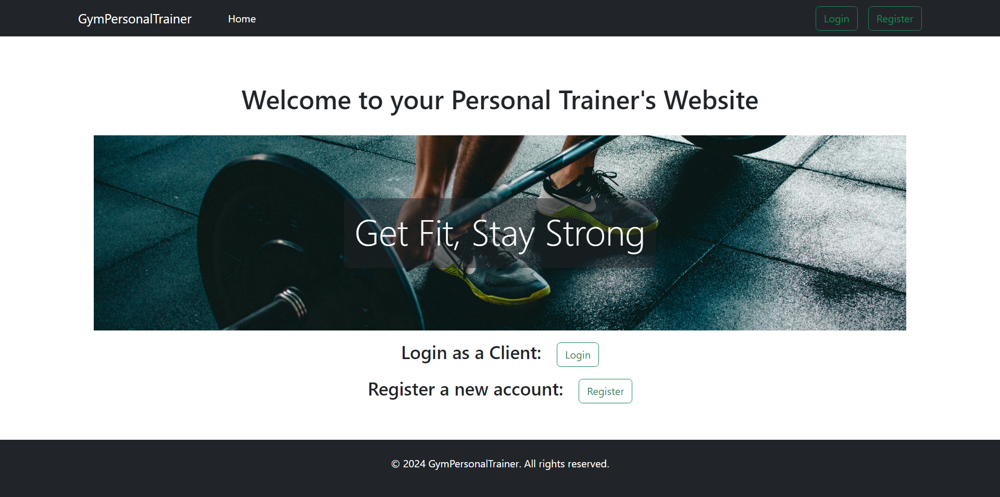
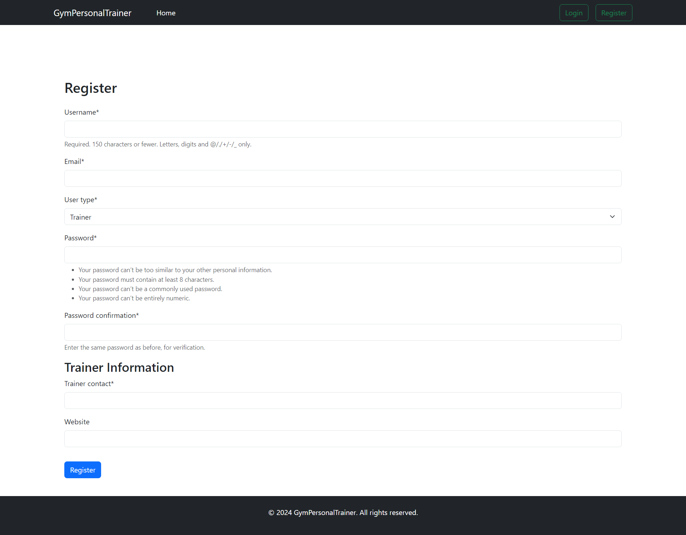
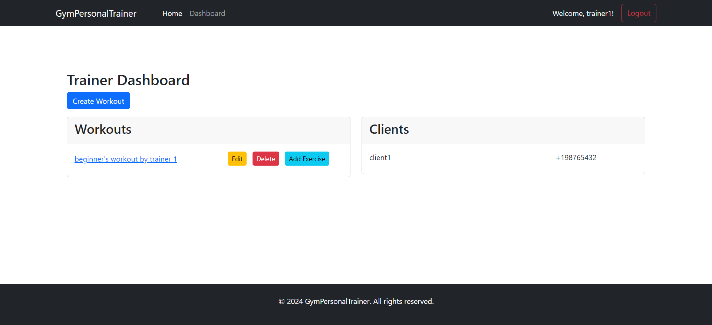
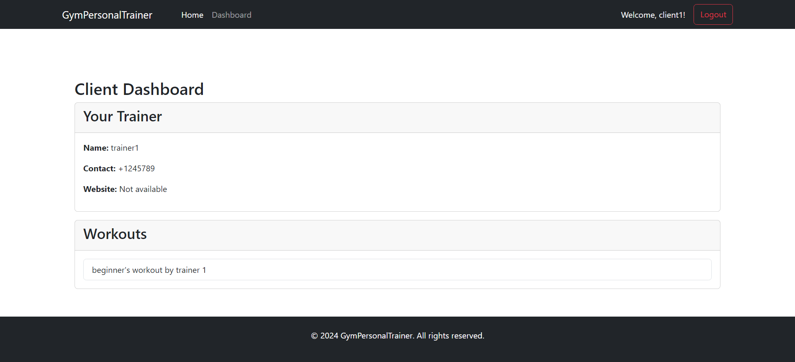
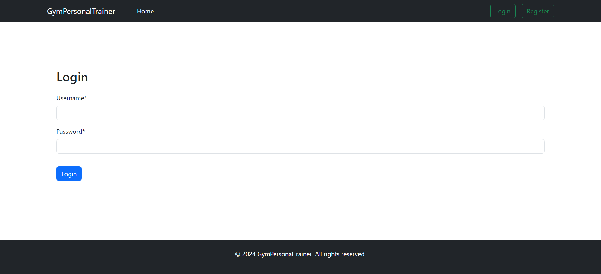
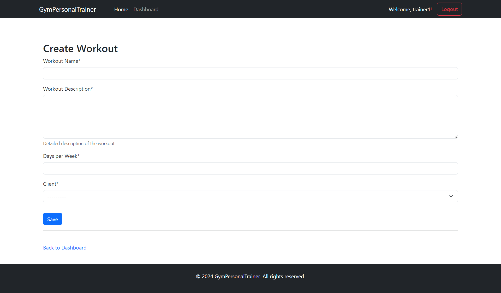
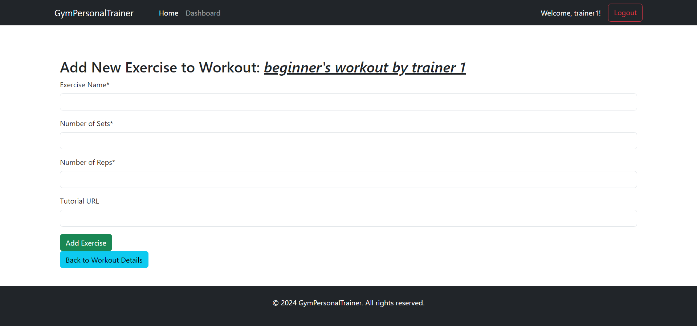
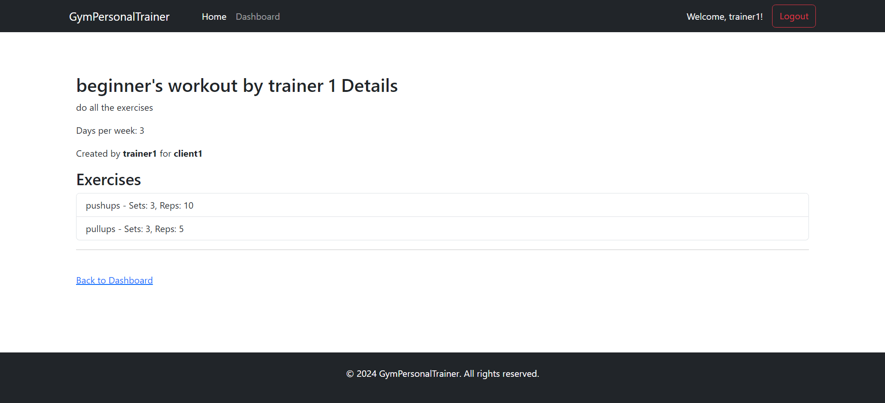

# GymPersonalTrainer

## Description

Django web application to manage client workouts as a personal trainer.

### Key Features
- Separate user registration forms for trainers and clients.
- Clients cannot register without knowing a trainer id.
- Display different dashboard based on what type of user is logged in.
- Trainers can create edit or delete workouts and add exercises into the workouts and assign them to a client.
- Clients can easily access the workouts created for them by their trainer.

## Screenshots

### Screenshot 1: Home Page

### Screenshot 2: Registration form

### Screenshot 3: Trainer Dashboard

### Screenshot 4: Client Dashboard

### Screenshot 5: Login Form

### Screenshot 6: Create Workout

### Screenshot 7: Create Exercise

### Screenshot 8: Workout View

## License

This project is licensed under the GNU Affero General Public License v3.0 - see the [LICENSE](LICENSE) file for details.